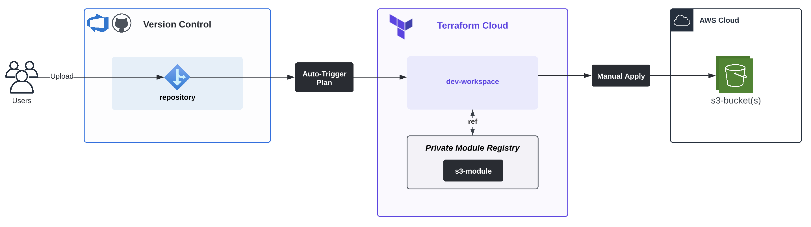

# Create S3 Bucket via Module: aws002
This project is similar to [aws002](../aws002/) but this time, I create the bucket through a [module](https://github.com/carlos-castillo-a/s3-module). The primary objective of this project is not the creation of the bucket itself, but to use the _Private Module Registry_ feature in Terraform Cloud.

### Workflow
This diagram shows how the s3-module is referenced by Workspaces in Terraform Cloud:

