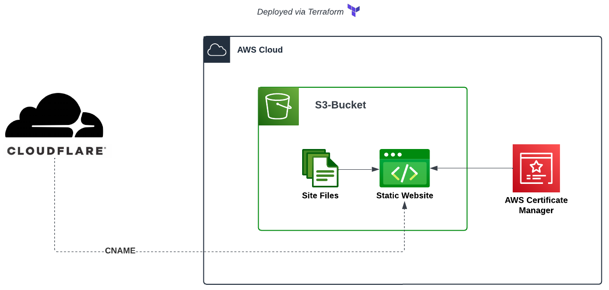

# Host static website
This project will be to create an S3 bucket that is open to the public and hosts a static website.

### Workflow
Cloudflare (CNAME record) -> S3 Static hosting (Workspaces) <- AWS Certificate manager (TLS/SSL)

