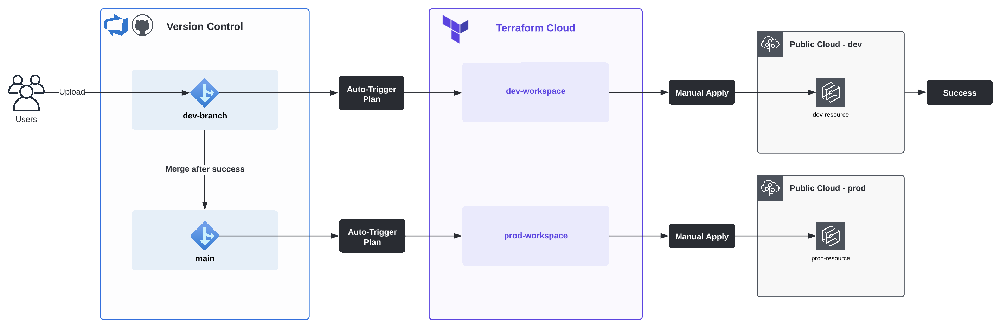
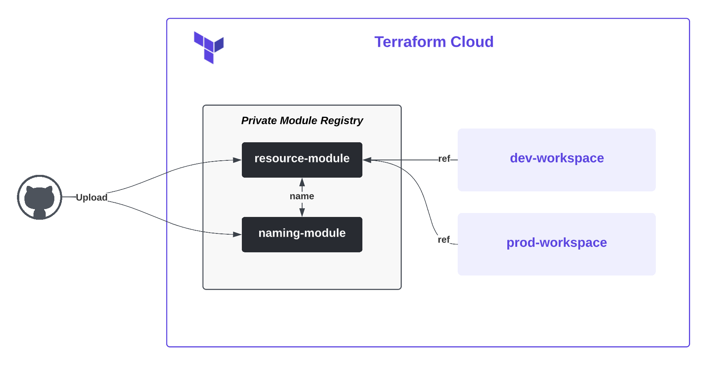

# Infrastructure as Code Repository

This repository serves as a storage for Infrastructure as Code (IaC) projects built on AWS, Azure, and GCP using Terraform and other tools. It organizes the contents of `.tf` configuration files for each platform and includes modules used to ensure standardization across different types of common resources. The primary goal of this project is to facilitate automated deployments and version control for IaC projects.

## Workflow
The projects in this repository are created using Terraform Cloud's Remote runs, as depicted in the following diagram:

## Modules
Modules are primarily controlled and versioned through GitHub. They can also be referenced using Terraform Cloud's **Private Module Registry** feature. The workflow for maintaining and utilizing modules is illustrated below:

Here is a list of available modules that can be referenced:

- [s3](https://github.com/carlos-castillo-a/s3-module)

## AWS
The following projects are connected to AWS:

- [aws001](./AWS/aws001/): Create an S3 bucket
- [aws002](./AWS/aws002/): Create an S3 bucket using a module
- [aws003](./AWS/aws003/): Deploy static site using S3 and Cloudflare
- [aws004](./AWS/aws004/): Create Lambda function to delete old S3 Objects (Incomplete)

## Azure
The following projects are connected to Azure:

- [az001](./Azure/az001/): Create a Storage Account

## Google Cloud Platform
Projects for GCP are yet to be determined.

--

Feel free to organize your IaC projects within the respective platform folders and leverage the available modules to streamline your infrastructure deployments.